# Bluetooth 42 Stepper Motor Balance Car — Detailed Design Document

> **Project Name**: Bluetooth 42 Stepper Motor Balance Car
>
> **Version**: Ver 1.0
>
> **Document Date**: 2025-05-23
>
> **Language**: C
>
> **Code Comments Language**: Chinese

---

## Table of Contents

1. [Project Overview](#1-project-overview)
2. [System Architecture](#2-system-architecture)
3. [Hardware Resource Allocation](#3-hardware-resource-allocation)
4. [RT-Thread Configuration](#4-rt-thread-configuration)
5. [Core Module Details](#5-core-module-details)
   - [5.1 main.c — Main Control Logic](#51-mainc--main-control-logic)
   - [5.2 Motor Control Module (rtt_motor_ctrl)](#52-motor-control-module-rtt_motor_ctrl)
   - [5.3 PID Controller (rtt_motor_pid)](#53-pid-controller-rtt_motor_pid)
   - [5.4 MPU6050 Attitude Estimation (macMPU)](#54-mpu6050-attitude-estimation-macmpu)
   - [5.5 Bluetooth Communication Protocol (rtt_uart2_Decode)](#55-bluetooth-communication-protocol-rtt_uart2_decode)
   - [5.6 PWM Output (bsp_pwm)](#56-pwm-output-bsp_pwm)
   - [5.7 Other Modules](#57-other-modules)
6. [Data Flow and Control Flow](#6-data-flow-and-control-flow)
7. [Build and Flash](#7-build-and-flash)
8. [Change Log](#8-change-log)

---

## 1. Project Overview

### 1.1 Project Objective

Design and implement a **two-wheel self-balancing robot** based on the STM32F103 microcontroller and RT-Thread real-time operating system. The robot uses two 42 stepper motors as actuators, an MPU6050 6-axis IMU for attitude sensing, and Bluetooth for wireless control via a mobile phone application.

### 1.2 Feature List

| Feature | Description | Status |
|---------|-------------|--------|
| Self-Balancing | PD vertical loop attitude closed-loop control | ✅ Implemented |
| Speed Control | PI speed loop closed-loop control with integral separation | ✅ Implemented |
| Forward/Backward | Bluetooth APP remote direction control | ✅ Implemented |
| Left/Right Turn | Bluetooth APP remote steering control | ✅ Implemented |
| Start/Stop | Bluetooth APP start/stop balancing | ✅ Implemented |
| Attitude Estimation | MPU6050 complementary filter, 100Hz update rate | ✅ Implemented |
| Sensor Calibration | Gyro static calibration, 6-sided accelerometer calibration | ✅ Implemented |
| LED Indication | Dual-color LED status (running/stopped), blink & breath modes | ✅ Implemented |
| Buzzer Alert | Command reception acknowledgment beep | ✅ Implemented |
| Parameter Storage | Flash first-run detection and storage | ✅ Implemented |
| Bluetooth Communication | Custom binary protocol, CRC16-Modbus checksum | ✅ Implemented |
| Debug Output | UART1 asynchronous printing, Vofa+ compatible visualization | ✅ Implemented |
| Motor Fault Detection | Periodic polling of stepper driver nFAULT pin | ✅ Implemented |

### 1.3 Hardware Platform

| Component | Model / Description |
|-----------|---------------------|
| **MCU** | STM32F103RC (Cortex-M3, 72MHz, 256KB Flash, 48KB SRAM) |
| **IMU Sensor** | MPU6050 (6-axis gyro + accelerometer), I²C interface |
| **Motor Type** | 42mm stepper motor (1.8° step angle) |
| **Motor Driver** | DRV8825-compatible driver (16 microstepping) |
| **Bluetooth Module** | Dual-mode Bluetooth module (SPP + BLE), UART2 interface |
| **Power Monitoring** | ADC1 battery voltage detection |
| **Display** | OLED display (reserved I²C1 interface) |
| **Wheels** | Diameter 65mm, circumference ≈ 204mm |

### 1.4 Software Framework

| Component | Description |
|-----------|-------------|
| **RTOS** | RT-Thread v4.0.3 (Extended Nano) |
| **HAL Library** | STM32F1 HAL Driver |
| **Driver Framework** | RT-Thread Device Driver Framework (PIN/I2C/PWM/ADC/Serial) |
| **Sensor Package** | mpu6xxx v1.1.1 (RT-Thread online package) |
| **Build System** | SCons (RT-Thread Studio built-in) |
| **Toolchain** | GCC ARM Embedded (arm-none-eabi-gcc) |
| **Debug Tool** | Vofa+ serial waveform visualization |

---

## 2. System Architecture

### 2.1 Overall Software Architecture

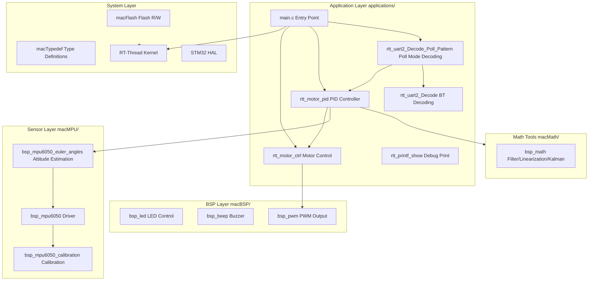

### 2.2 Directory Structure

```
Diy-code_balance-car_ver1.0/
├── applications/                    # Application layer
│   ├── main.c                       # Main entry point
│   ├── macAPP/                      # Core application modules
│   │   ├── Inc/
│   │   │   ├── rtt_motor_ctrl.h     # Motor control header
│   │   │   ├── rtt_motor_pid.h      # PID controller header
│   │   │   ├── rtt_printf_show.h    # Debug print header
│   │   │   ├── rtt_uart2_Decode.h   # BT command parsing (DMA) header
│   │   │   └── rtt_uart2_Decode_Poll_Pattern.h # Poll mode decode header
│   │   └── Scr/
│   │       ├── rtt_motor_ctrl.c     # Motor control module
│   │       ├── rtt_motor_pid.c      # PID controller module
│   │       ├── rtt_printf_show.c    # Debug print module
│   │       ├── rtt_uart2_Decode.c   # BT command parsing (DMA mode)
│   │       └── rtt_uart2_Decode_Poll_Pattern.c # Poll mode decode module
│   ├── macBSP/                      # Board support package
│   │   ├── Inc/
│   │   │   ├── bsp_beep.h           # Buzzer header
│   │   │   ├── bsp_led.h            # LED header
│   │   │   └── bsp_pwm.h            # PWM header
│   │   └── Scr/
│   │       ├── bsp_beep.c           # Buzzer driver
│   │       ├── bsp_led.c            # LED driver
│   │       └── bsp_pwm.c            # PWM driver
│   ├── macMPU/                      # MPU6050 sensor module
│   │   ├── Inc/
│   │   │   ├── bsp_mpu6050.h        # MPU6050 driver header
│   │   │   ├── bsp_mpu6050_calibration.h # Calibration header
│   │   │   └── bsp_mpu6050_euler_angles.h # Attitude estimation header
│   │   └── Scr/
│   │       ├── bsp_mpu6050.c        # MPU6050 driver implementation
│   │       ├── bsp_mpu6050_calibration.c # Calibration implementation
│   │       └── bsp_mpu6050_euler_angles.c # Attitude estimation implementation
│   ├── macMath/                     # Math tools
│   │   ├── Inc/
│   │   │   └── bsp_math.h           # Math functions header
│   │   └── Scr/
│   │       └── bsp_math.c           # Filter/linearization/Kalman implementation
│   ├── macFLASH/                    # Flash storage
│   │   ├── Inc/
│   │   │   └── macFlash.h           # Flash header
│   │   └── Scr/
│   │       └── macFlash.c           # Flash R/W implementation
│   └── macSYS/                      # System layer
│       ├── Inc/
│       │   ├── macSYS.h             # System header (all includes)
│       │   └── macTypedef.h         # Type definitions, enums, global flags
│       └── Scr/
│           ├── macSYS.c             # System variable definitions
│           └── macTypedef.c         # Type variable instances
├── cubemx/                          # CubeMX auto-generated code
├── drivers/                         # RT-Thread driver layer
│   ├── board.c / board.h            # Board-level init & hardware config
│   ├── drv_pwm.c                    # PWM driver
│   ├── drv_usart.c                  # UART driver
│   ├── drv_gpio.c                   # GPIO driver
│   └── drv_adc.c                    # ADC driver
├── packages/                        # RT-Thread online packages
│   └── mpu6xxx-v1.1.1/              # MPU6xxx sensor driver package
├── libraries/                       # STM32 HAL library
├── rt-thread/                       # RT-Thread kernel source
├── linkscripts/                     # Linker scripts
├── rtconfig.h                       # RT-Thread configuration
├── .config                          # Kconfig configuration
├── SConstruct / SConscript          # SCons build scripts
└── rtconfig.py                      # Toolchain configuration
```

### 2.3 Module Dependencies

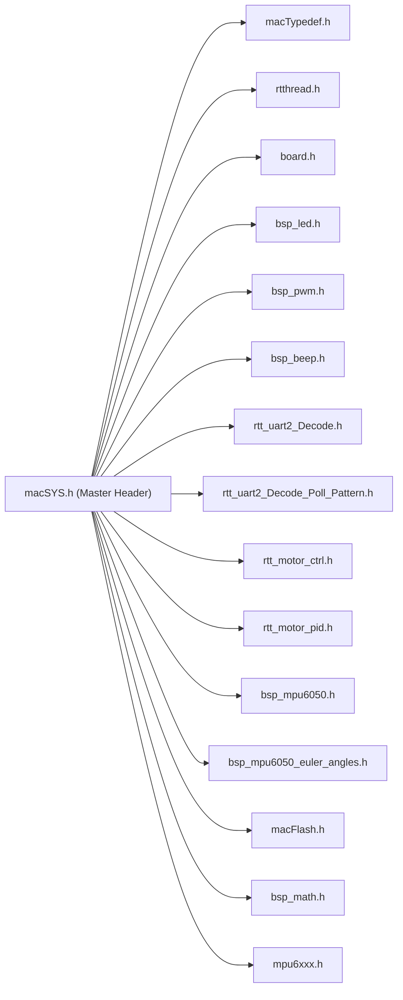

> All application layer modules indirectly include all headers via `macSYS.h`.

---

## 3. Hardware Resource Allocation

### 3.1 GPIO Pin Mapping Table

| Function | Pin | GPIO# | Description |
|----------|-----|-------|-------------|
| **BT UART2 TX** | PA2 | 2 | Bluetooth module data transmit |
| **BT UART2 RX** | PA3 | 3 | Bluetooth module data receive |
| **Debug UART1 TX** | PA9 | 9 | Debug serial transmit (Finsh) |
| **Debug UART1 RX** | PA10 | 10 | Debug serial receive (Finsh) |
| **OLED I2C1 SCL** | PC8 | 40 | OLED clock line |
| **OLED I2C1 SDA** | PC7 | 39 | OLED data line |
| **MPU6050 I2C2 SCL** | PC6 | 38 | Sensor clock line |
| **MPU6050 I2C2 SDA** | PB15 | 31 | Sensor data line |
| **Motor1 PWM (Right)** | PB0 | 16 | TIM3_CH3 pulse output |
| **Motor2 PWM (Left)** | PB1 | 17 | TIM3_CH4 pulse output |
| **Motor1 DIR (Right)** | PA4 | 4 | Direction control |
| **Motor1 ENABLE (Right)** | PB3 | 19 | Enable control (active low) |
| **Motor1 nRESET (Right)** | PA8 | 8 | Driver reset |
| **Motor1 nFAULT (Right)** | PB11 | 27 | Driver fault detection |
| **Motor1 DECAY (Right)** | PB11 | 27 | Decay mode (shared with nFAULT) |
| **Motor2 DIR (Left)** | PA12 | 12 | Direction control |
| **Motor2 ENABLE (Left)** | PB12 | 28 | Enable control |
| **Motor2 nRESET (Left)** | PB13 | 29 | Driver reset |
| **Motor2 nFAULT (Left)** | PB10 | 26 | Driver fault detection |
| **Motor2 DECAY (Left)** | PA7 | 7 | Decay mode |
| **LED1** | PB5 | 21 | Status indicator 1 |
| **LED2** | PB6 | 22 | Status indicator 2 |
| **Buzzer** | PB8 | 24 | Buzzer |
| **ADC Battery** | — | ADC1 | Battery voltage detection |

### 3.2 Peripheral Resource Allocation

| Peripheral | Instance | Function | Pins | DMA |
|------------|----------|----------|------|-----|
| UART1 | USART1 | Debug serial / Finsh console | TX:PA9, RX:PA10 | — |
| UART2 | USART2 | Bluetooth communication | TX:PA2, RX:PA3 | Optional DMA RX |
| I2C1 | Software I2C | OLED display | SCL:PC8, SDA:PC7 | — |
| I2C2 | Software I2C | MPU6050 sensor | SCL:PC6, SDA:PB15 | — |
| TIM3 | TIM3_CH3 | Motor1 PWM (Right) | PB0 | — |
| TIM3 | TIM3_CH4 | Motor2 PWM (Left) | PB1 | — |
| ADC1 | ADC1 | Battery voltage | — | — |

### 3.3 Clock Configuration

| Parameter | Value |
|-----------|-------|
| Clock Source | HSE 8MHz |
| PLL Multiplier | ×9 |
| System Clock (SYSCLK) | 72 MHz |
| APB1 Clock | 36 MHz |
| APB2 Clock | 72 MHz |
| SysTick | 1ms (RT-Thread system tick) |

### 3.4 Memory Layout

| Region | Start Address | Size |
|--------|--------------|------|
| Flash | 0x08000000 | 256 KB |
| Flash User Data | 0x0801FC00 (Sector 127) | 1 KB |
| SRAM | 0x20000000 | 48 KB |

---

## 4. RT-Thread Configuration

### 4.1 Thread Configuration Table

| Thread Name | Priority | Stack | Timeslice | Description |
|-------------|----------|-------|-----------|-------------|
| `tshell` | 20 | 4096 | — | Finsh command console |
| `main` | 5 | 2048 | — | Main thread (suspended after init) |
| `timer` | 4 | 2048 | — | Software timer service thread |
| `car_euler_angles_thread_entry` | 5 | 2048 | 20 | MPU6050 attitude estimation (100Hz) |
| `uart2_decode_thread_entry` | 6 | 2048 | 500 | BT command reception & parsing |
| `balance_car_thread_entry` | 20 | 2048 | 500 | PID balance control (200Hz) |
| `mpu6xxx_cali_thread_entry` | 6 | 2048 | 500 | MPU6050 calibration thread |
| `printf_show_thread_entry` | 29 | 2048 | 500 | Debug info printing |
| `ledTimer_callback` (timer) | 4 (timer) | — | 1ms | LED scan timer |
| `beepTimer_callback` (timer) | 4 (timer) | — | 1ms | Buzzer scan timer |
| `motorCheckTimer_callback` (timer) | 4 (timer) | — | 100ms | Motor fault check timer |

### 4.2 Kernel Configuration

```c
#define RT_NAME_MAX                     30      // Max thread name length
#define RT_ALIGN_SIZE                   4       // Byte alignment
#define RT_THREAD_PRIORITY_32                   // 32 priority levels
#define RT_THREAD_PRIORITY_MAX          32
#define RT_TICK_PER_SECOND              1000    // 1kHz system tick
#define RT_USING_OVERFLOW_CHECK                  // Stack overflow check
#define RT_USING_HOOK                            // System hook functions
#define RT_USING_IDLE_HOOK                       // Idle thread hook
#define IDLE_THREAD_STACK_SIZE          2048
#define RT_USING_TIMER_SOFT                      // Software timers
#define RT_TIMER_THREAD_PRIO            4
#define RT_TIMER_THREAD_STACK_SIZE      2048
```

### 4.3 IPC Components Enabled

| Component | Status | Usage |
|-----------|--------|-------|
| Semaphore | ✅ | UART receive semaphore |
| Mutex | ✅ | Ring buffer mutex lock |
| Event | ✅ | Event flag group |
| Mailbox | ✅ | Mailbox communication |
| Message Queue | ✅ | BT DMA data message queue |
| Memory Pool | ✅ | Memory pool |

### 4.4 Drivers and Components Enabled

| Component | Macro | Status |
|-----------|-------|--------|
| Console (Finsh) | `RT_USING_FINSH` | ✅ |
| Serial Driver | `RT_USING_SERIAL` | ✅ |
| I2C Driver | `RT_USING_I2C` + `RT_USING_I2C_BITOPS` | ✅ |
| PIN Driver | `RT_USING_PIN` | ✅ |
| ADC Driver | `RT_USING_ADC` | ✅ |
| PWM Driver | `RT_USING_PWM` | ✅ |
| Device IPC | `RT_USING_DEVICE_IPC` | ✅ |
| MPU6XXX Package | `PKG_USING_MPU6XXX_V111` | ✅ |
| rt_vsnprintf_full | `PKG_USING_RT_VSNPRINTF_FULL` | ✅ |
| C++ Support | `RT_USING_CPLUSPLUS` | ✅ |
| LIBC | `RT_USING_LIBC` | ✅ |

---

## 5. Core Module Details

### 5.1 main.c — Main Control Logic

#### Startup Flow

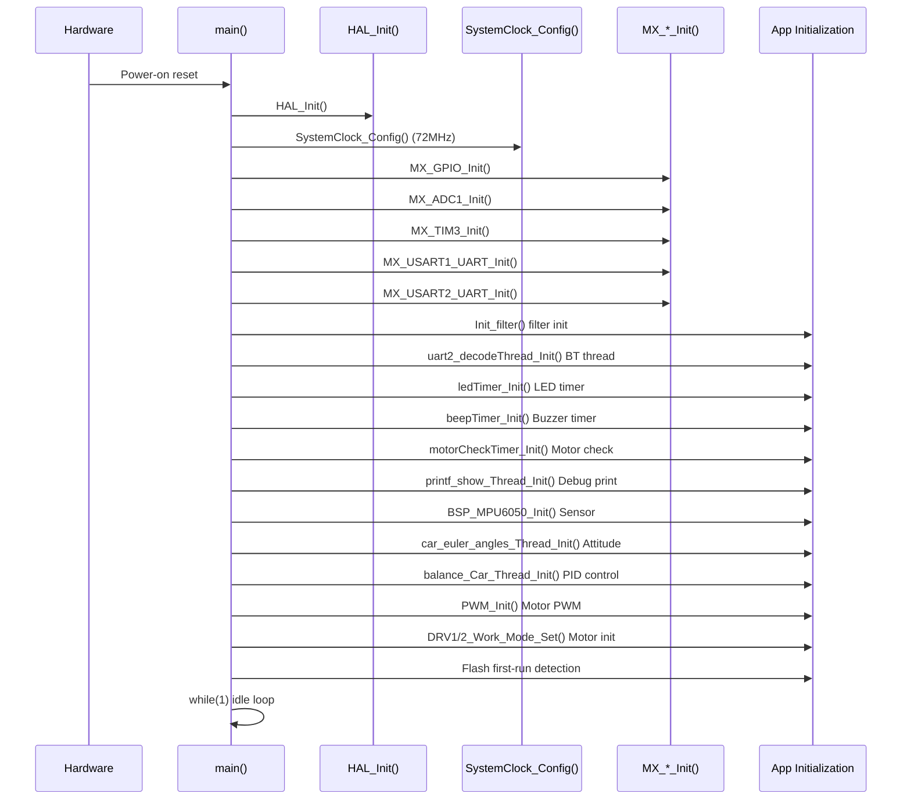

#### Initialization Order Rationale

The initialization follows a **dependency-first** principle:

1. **Filter init first**: Filters used by the PID module are initialized first
2. **Communication thread**: BT decode thread is created early to avoid frame loss
3. **Peripheral drivers**: LED/Buzzer/Motor check timer drivers
4. **Debug output thread**: Enables logging for subsequent module initialization
5. **Sensor init**: MPU6050 via RT-Thread mpu6xxx package
6. **Attitude estimation thread**: Depends on sensor being initialized
7. **PID balance thread**: Depends on attitude thread providing angle data
8. **PWM output init**: Motor drive pulse output
9. **Flash first-run detection**: Reads Flash Sector 127 (`0x0801FC00`), checks if `0x66`:
   - First run (`!= 0x66`): Sends BT AT commands (enter command mode → set BLE name → reset), writes `0x66` marker
   - Subsequent run (`== 0x66`): Skips AT config, enters protocol mode directly

#### Bluetooth Module First-time Configuration (Poll Pattern Mode)

```c
// AT command sequence
"AT+ENAT\r\n"              // Enter command mode
"AT+LENABalanceCar\r\n"    // BLE name: BalanceCar
"AT+REST\r\n"              // BT module reset
```

After reset, the module enters data transparent transmission mode. `Flag.AT_REC_Mode = 0` and `Flag.Protocal_Mode = 1` switch to binary protocol mode.

---

### 5.2 Motor Control Module (rtt_motor_ctrl)

#### Stepper Motor Parameters

| Parameter | Value | Notes |
|-----------|-------|-------|
| Step Angle | 1.8° | Degrees per step |
| Microstep | 16 | Driver microstepping setting |
| Pulses per Revolution | 3200 | 360° ÷ 1.8° × 16 |
| Wheel Diameter | 65mm | |
| Wheel Circumference | ≈ 204mm | |

#### Speed Calculation Formula

```
Steps per revolution = 360° / step_angle(1.8°) × microstep(16) = 3200 pulses/rev

RPM = pulse_frequency(Hz) / steps_per_revolution × 60

Linear speed(m/s) = RPM × circumference(m) / 60
```

#### Control API

**Single Motor Control:**

| Function | Purpose | Parameters |
|----------|---------|------------|
| `DRV1_Enable_Set(status)` | Motor1 enable/disable | `drv_en`(0)/`drv_disen`(1) |
| `DRV1_Direction_Config(direction)` | Motor1 direction | `clockwise`(1)/`anticlockwise`(0) |
| `DRV1_nRESET_Config(value)` | Motor1 reset control | `drv_set`(1)/`drv_reset`(0) |
| `DRV1_Decay_Config(decay)` | Motor1 decay mode | `slow`/`quick`/`mixed_decay` |
| `DRV2_Enable_Set(status)` | Motor2 enable/disable | Same as above |
| `DRV2_Direction_Config(direction)` | Motor2 direction | Same as above |
| `DRV2_nRESET_Config(value)` | Motor2 reset control | Same as above |
| `DRV2_Decay_Config(decay)` | Motor2 decay mode | Same as above |

**Coordinated Control:**

| Function | Purpose |
|----------|---------|
| `DRV1_Work_Mode_Set(status, dir, Period, Duty)` | Motor1 full work mode setup |
| `DRV2_Work_Mode_Set(status, dir, Period, Duty)` | Motor2 full work mode setup |
| `ALL_Motor_Direction_Config(dir)` | Auto-set both motors direction based on tilt |

#### Left/Right Motor Mapping

| Motor | Position | Forward Direction |
|-------|----------|-------------------|
| **DRV1** | Right wheel | `anticlockwise` |
| **DRV2** | Left wheel | `clockwise` |

#### Motor Fault Detection

The `motorCheckTimer` polls `DRV1_nFAULT` / `DRV2_nFAULT` pins every 100ms:
- Low level (`GPIO_PIN_RESET`): Motor driver fault, prints hard fault log
- High level: Normal

#### Pick-up Detection (WIP)

`If_Car_Was_Picked_Up()` function is declared but implementation is empty. Planned to detect via Z-axis acceleration and pitch angle changes.

---

### 5.3 PID Controller (rtt_motor_pid)

#### PID Architecture

The balance control system uses a **dual-loop cascade PID** structure:

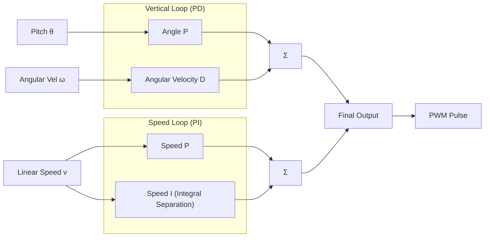

#### Vertical Loop (PD Controller)

**Mathematical model**: `Output = Kp * (θ - θ_target) + Kd * (ω - 0)`

| Parameter | Value | Notes |
|-----------|-------|-------|
| Kp | 15.0 | Proportional gain |
| Ki | 0 | Integral disabled |
| Kd | 0.1 | Derivative gain |
| dt | 0.005s (5ms) | Control period |
| Output limit | ±1300 | Pulse frequency (Hz) |
| Mechanical median | 0.36° | Balance neutral angle |

**Control logic**:
1. Angle error = present angle − mechanical median (0.36°)
2. Apply moving average filter to angle error (MVF_LENGTH=4)
3. Angular velocity conversion: MPU6050 unit `deg/10s` → `deg/s` (×0.1)
4. **PD calculation**: `Out = Kp × angle_error + Kd × angular_velocity`
5. Output clamped to `±1300`

> Note: Vertical loop uses **PD control** (no integral). The D term directly uses raw gyro angular velocity for fast response.

#### Speed Loop (PI Controller)

**Mathematical model**: `Output = Kp * (v_target − v_present) + Ki * Σ(bias * dt)`

| Parameter | Value | Notes |
|-----------|-------|-------|
| Kp | 10.0 | Proportional gain |
| Ki | 0.1 | Integral gain |
| Kd | 0 | Derivative disabled |
| dt | 0.005s | Control period |
| Integral separation threshold | ±3000 | Pause integral when error too large |
| Integral limit | ±3000 | Integral value clamp |
| Output limit | ±6000 | Pulse frequency (Hz) |
| Speed target (forward) | 2000 | Integral bias for forward |
| Speed target (backward) | -2000 | Integral bias for backward |

**Control logic**:
1. Estimate current speed: `v = ∫(accel_x − g·sinθ)dt` (accelerometer integration)
2. Apply moving average + first-order low-pass filter (α=0.7) to speed
3. **Integral separation**: Skip integral accumulation when speed error exceeds ±3000
4. Forward/backward commands: overlay ±2000 bias on integral (`Movement`)
5. Integral clamped to `±3000`
6. **PI calculation**: `Out = Kp × speed_error + Ki × integral`
7. Output clamped to `±6000`

> Note: The speed loop controls forward/backward by **modifying the integral accumulation** rather than directly changing the target speed. Forward adds +2000 bias, backward adds -2000.

#### Output Linearization

The PID output from the vertical loop is processed by `linearized_output()`:

```
If PID output < 0 → backward direction, Left_Direction=Right_Direction=0
If PID output ≥ 0 → forward direction, Left_Direction=Right_Direction=1

Output = PID output limit(1300) − |PID output|
If Output < 900 → Output = 900 (minimum frequency)
```

Meaning:
- Greater tilt → larger |PID output| → smaller Output → shorter PWM period → higher frequency → faster motor
- Balanced state PID output ≈ 0 → Output ≈ 1300 → longer PWM period → lower frequency

#### PID Data Structure

```c
struct _PID_T {
    PID_Parameter speedParam;       // Speed loop params (kp, ki, kd, limits, thresholds)
    PID_Parameter verticalParam;    // Vertical loop params (kp, ki, kd, limits, thresholds)
    PID_Process   speedProcess;     // Speed loop process variables (error, integral, output)
    PID_Process   verticalProcess;  // Vertical loop process variables (error, integral, output)
};
```

#### Balance Control Thread (balance_car_thread_entry)

- **Priority**: 20 (lower)
- **Stack size**: 2048 bytes
- **Control period**: 5ms (200Hz)
- **Execution flow**:

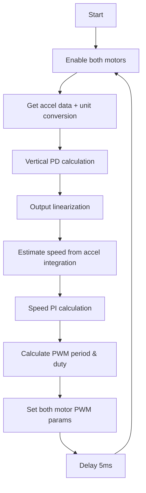

---

### 5.4 MPU6050 Attitude Estimation (macMPU)

#### Sensor Initialization

Driven via RT-Thread `mpu6xxx` package:

```c
// Software I2C2 (SCL:PC6, SDA:PB15)
mpu6050_dev = mpu6xxx_init("i2c2", RT_NULL);
```

#### Data Reading

```c
mpu6xxx_get_accel(dev, &bsp_accel);  // Raw values, unit: mg
mpu6xxx_get_gyro(dev, &bsp_gyro);    // Raw values, unit: deg/10s
```

#### Attitude Estimation Algorithm — Complementary Filter

**Core principle**: `angle = α * gyro_integration + (1-α) * accel_angle`

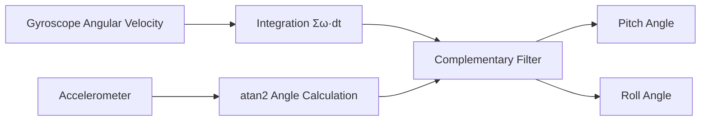

**Key Parameters:**

| Parameter | Value | Notes |
|-----------|-------|-------|
| Sample Rate | 100 Hz | SAMPLE_RATE |
| Sample Period | 10 ms | DT = 1/100 |
| Complementary Filter α | 0.99 | 99% trust gyro, 1% trust accel |
| Gyro Unit Conversion | ×0.1 | deg/10s → deg/s |

**Estimation process**:

1. **Coordinate transform**: `transform_coordinates()` supports X/Y axis swap (currently `nothing` mode)
2. **Accelerometer angle calculation**:
   ```c
   pitch_acc = atan2(-ax, sqrt(ay² + az²)) * RAD_TO_DEG;
   roll_acc  = atan2(ay, az) * RAD_TO_DEG;
   ```
3. **Gyro integration**:
   ```c
   pitch += gyro_y * 0.1 * DT;  // About Y axis → Pitch
   roll  += gyro_x * 0.1 * DT;  // About X axis → Roll
   ```
4. **Complementary fusion**:
   ```c
   pitch = 0.99 * pitch + 0.01 * pitch_acc;
   roll  = 0.99 * roll  + 0.01 * roll_acc;
   ```

> Yaw angle requires magnetometer support, not currently implemented.

#### Euler Angles Data Structure

```c
typedef struct {
    float pitch;  // Pitch angle (degrees)
    float roll;   // Roll angle (degrees)
    float yaw;    // Yaw angle (degrees) — unused
} EulerAngles;
```

Global variable `carEulerAngles` stores the latest attitude data.

#### Calibration Module

##### Gyro Static Calibration

Triggered by APP command (`FRAME_SET_CAR_GYRO_CALIBRATION_CMD`), executed in `mpu6xxx_cali_thread_entry`:

1. Collect 200 raw gyro samples (10ms intervals, 2 seconds total)
2. Calculate 3-axis average as zero-bias offset
3. Call `mpu6xxx_set_gyro_offset()` to write to MPU6050 offset registers
4. Notify APP on completion: `Order_SEND_CAR_IS_FINISHED_GYRO_CALI_CMD`

##### 6-Sided Accelerometer Calibration

Triggered by APP commands, sequentially orient each MPU6050 face downward, collecting 50 samples per face:
- X+ / X- (0x18 / 0x19)
- Y+ / Y- (0x1A / 0x1B)
- Z+ / Z- (0x1C / 0x1D)
- After completion: calculate min/max per axis, compute offset and write to registers

---

### 5.5 Bluetooth Communication Protocol (rtt_uart2_Decode)

#### Communication Mode

The system supports **two communication modes**, controlled by the `USE_UART2_DMA_MODE` macro:

| Mode | Macro | Implementation |
|------|-------|----------------|
| Poll Mode | `USE_UART2_DMA_MODE = 0` | Interrupt RX → semaphore → ring buffer → byte-by-byte state machine parsing |
| DMA Mode | `USE_UART2_DMA_MODE = 1` | DMA RX → message queue → block data parsing + secondary frame fusion parsing |

> The current project uses **Poll Mode** via `rtt_uart2_Decode_Poll_Pattern.c`.

#### Frame Format

```
┌──────┬──────┬──────┬─────────────┬───────┬─────────────────────────┬──────────────┐
│ 0x55 │ 0xAA │ Len  │  DeviceID   │ Cmd   │   Data (Len−4 bytes)     │   CRC16      │
│ HDR1 │ HDR2 │ 1B   │ H(0x00)     │ Type  │  Variable length payload │  2 bytes     │
│      │      │      │ L(0x01)     │       │                         │  checksum    │
└──────┴──────┴──────┴─────────────┴───────┴─────────────────────────┴──────────────┘
```

**Field descriptions:**

| Field | Offset | Size | Value / Description |
|-------|--------|------|---------------------|
| Frame Head 1 | 0 | 1 | `0x55` |
| Frame Head 2 | 1 | 1 | `0xAA` |
| Length | 2 | 1 | Payload length (excluding frame headers, including all fields before CRC) |
| Device ID H | 3 | 1 | `0x00` (mainboard ID high) |
| Device ID L | 4 | 1 | `0x01` (mainboard ID low) |
| Cmd Type | 5 | 1 | Command type (0x31/0x32/0x33/0x66) |
| Cmd Status | 6 | 1 | Command status (0x00/0x01/0x02) |
| Data | 7+ | N | Specific command data |
| CRC16 L | -2 | 1 | CRC-16/Modbus low byte |
| CRC16 H | -1 | 1 | CRC-16/Modbus high byte |

**CRC**: Uses CRC-16/Modbus standard polynomial `X¹⁶+X¹⁵+X²+1` (0xA001)

#### Frame Type Macros

| Macro | Value | Meaning |
|-------|-------|---------|
| `FRAME_TYPE_SET` | `0x31` | Parameter setting (APP → Board) |
| `FRAME_TYPE_ACT` | `0x32` | Active report (Board → APP) |
| `FRAME_TYPE_GET` | `0x33` | Parameter query |
| `FRAME_TYPE_POST` | `0x66` | Active push status |

#### Complete Command Set

##### APP → Board (Setting Commands 0x31)

| Command | Name | Data | Description |
|---------|------|------|-------------|
| `0x00` | Broadcast | — | Communication test |
| `0x10` | Forward | — | Move car forward |
| `0x11` | Backward | — | Move car backward |
| `0x12` | Turn Left | — | Turn car left |
| `0x13` | Turn Right | — | Turn car right |
| `0x14` | Start Balancing | 1B: 1=start | Enable balance control |
| `0x15` | Stop | 1B: 0=stop | Disable balance control |
| `0x16` | Set Speed | — | Set target speed (reserved) |
| `0x17` | 6-Sided Calibration | — | Start full calibration process |
| `0x18` | X+ Face Down | — | X-axis positive downward |
| `0x19` | X- Face Down | — | X-axis negative downward |
| `0x1A` | Y+ Face Down | — | Y-axis positive downward |
| `0x1B` | Y- Face Down | — | Y-axis negative downward |
| `0x1C` | Z+ Face Down | — | Z-axis positive downward |
| `0x1D` | Z- Face Down | — | Z-axis negative downward |
| `0x1E` | Gyro Static Calibration | — | Calibrate gyro bias at rest |
| `0x1F` | Calibration Status Report | 1B: step | Active calibration progress report |
| `0x20` | Running Mode | — | Set running mode (reserved) |
| `0x21` | Mechanical Median Calibration | — | Set balance mechanical median |

##### Board → APP (Active Report 0x32)

| Command | Name | Data | Description |
|---------|------|------|-------------|
| `0xA2` | Ready | — | Boot complete, notify APP |
| `0x1F` | Calibration Status | 1B: step code | Report current calibration progress |

#### Parsing State Machine (Poll Mode)

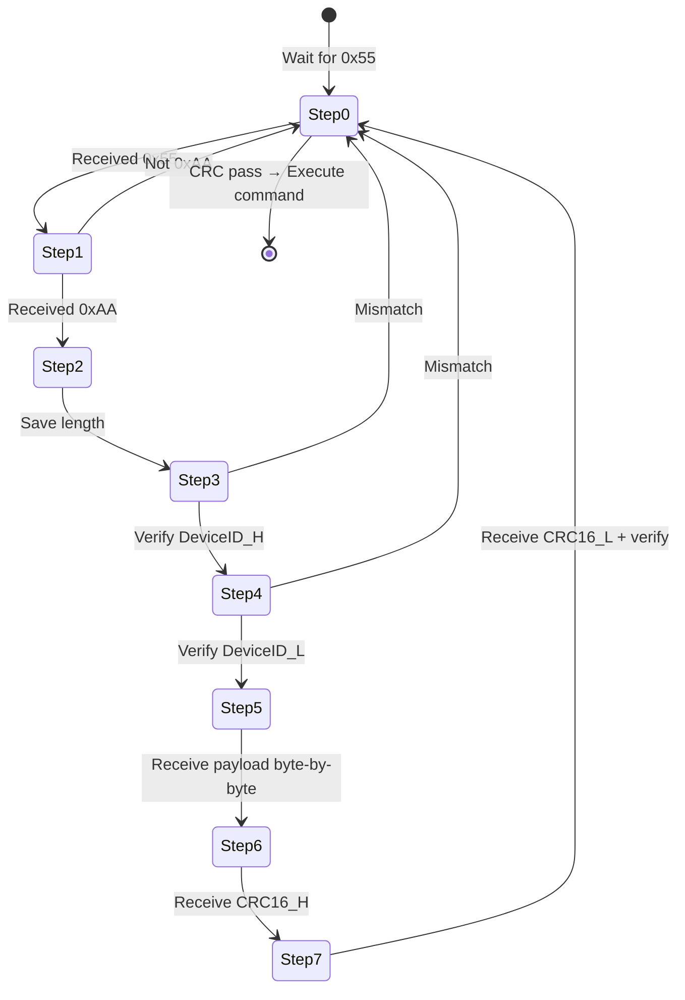

#### UART Receive Flow (Poll Mode)

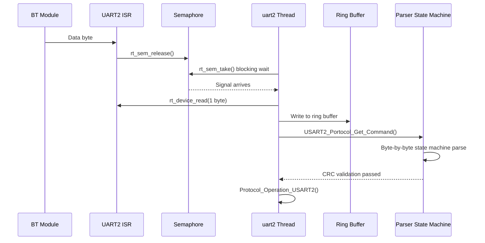

---

### 5.6 PWM Output (bsp_pwm)

#### PWM Configuration

| Parameter | Value | Notes |
|-----------|-------|-------|
| **Timer** | TIM3 | 16-bit advanced timer |
| **Channels** | CH3 (Motor1/Right), CH4 (Motor2/Left) |
| **PWM Mode** | PWM1 | Up-count, high when < CCR |
| **Default Period** | 1000ms (1Hz) | Post-initialization default |
| **Default Duty** | 50% | Post-initialization default |

#### Key Functions

| Function | Purpose | Parameters |
|----------|---------|------------|
| `PWM_Init()` | Initialize PWM devices | Find `pwm3` device, set default params |
| `Motor1_Device_Set(Period, Duty)` | Motor1 PWM output | Period: μs, Duty: μs |
| `Motor2_Device_Set(Period, Duty)` | Motor2 PWM output | Same as above |
| `Motor_Duty_Calculate(Period)` | Calculate duty cycle | Duty = Period / 2 (50%) |

**Note**: `Motor1_Device_Set()` actually controls `pwm_dev2` (TIM3_CH4), while `Motor2_Device_Set()` controls `pwm_dev1` (TIM3_CH3). The mapping is handled internally.

#### Drive Signal Generation

Stepper motor speed is controlled by pulse frequency:
- Balance control thread updates PWM period every 5ms
- PID output value directly serves as pulse period (μs), frequency = 1/period
- Duty fixed at 50% (`Motor_Duty_Calculate`)
- Period range: 900~1300 μs (frequency 769~1111 Hz)

---

### 5.7 Other Modules

#### 5.7.1 LED Module (bsp_led)

**LED Definitions:**
| LED | GPIO | Pin# |
|-----|------|------|
| LED1 | PB5 | 21 |
| LED2 | PB6 | 22 |

**Features:**
- **On/Off**: `LED_On()`, `LED_Off()`
- **Toggle**: `LED_Toggle()`
- **Blink**: `LED_Blink(name, cry, mute, repeat)` — supports period, count, repeat control
- **Breath/Gradient**: `LED_Grad()` — PWM-simulated breathing effect
- **Timebase**: 1ms software timer (`ledTimer_callback`)

**Status Indication:**
- LED1 on: Car in balancing state
- LED2 on: Car in stopped state
- Valid BT command received: LED1 blinks once

#### 5.7.2 Buzzer Module (bsp_beep)

**Pin**: PB8

**Features:**
- **Continuous on/off**: `BEEP_On()`, `BEEP_Off()`
- **Interval beeping**: `BEEP_Blink(cry, mute, repeat)` — supports 3-level period control
- **Timebase**: 1ms software timer, default 200ms period, 100ms duty
- **Command feedback**: Beeps once when valid BT command received

#### 5.7.3 Flash Parameter Storage (macFlash)

Uses STM32 on-chip Flash last page (Sector 127, `0x0801FC00`) for configuration storage:

| Function | Address | Data |
|----------|---------|------|
| First boot marker | `0x0801FC00` | `0x66` = initialization complete |

**API Functions:**
- `macNorFlash_Read_Byte/Word()` — Read Flash
- `macNorFlash_Write_Byte/Word()` — Write Flash
- `macNorFlash_Erase_Page()` — Erase page

#### 5.7.4 Math Tools (bsp_math)

| Function | Purpose | Notes |
|----------|---------|-------|
| `moving_average_filtre()` | Moving average filter | Window size `MVF_LENGTH=4` |
| `FOLowPassFilter(In, LastOut, a)` | First-order low-pass filter | `Out = a·In + (1-a)·LastOut` |
| `linearized_output(mode, Values)` | Output linearization | PID output → PWM period mapping |
| `kalman_filter_for_pitch()` | Kalman filter (pitch) | 2-state Kalman (angle+bias), implemented but unused |
| `myabs()` | Absolute value | Integer version |

**Filter Instances:**
- `Speed_Move_Filter`: Speed moving average filter
- `Angle_Move_Filter`: Angle error moving average filter

#### 5.7.5 Debug Print Module (rtt_printf_show)

- **Priority**: 29 (lowest)
- **Function**: Output real-time PID values via UART1
- **Vofa+ Compatible**: CSV data output via `<any>` tag for Vofa+ visualization
- **Selective output**: Toggle vertical loop, speed loop, and Vofa+ output via `mylog` struct switches

---

## 6. Data Flow and Control Flow

### 6.1 Main Control Loop

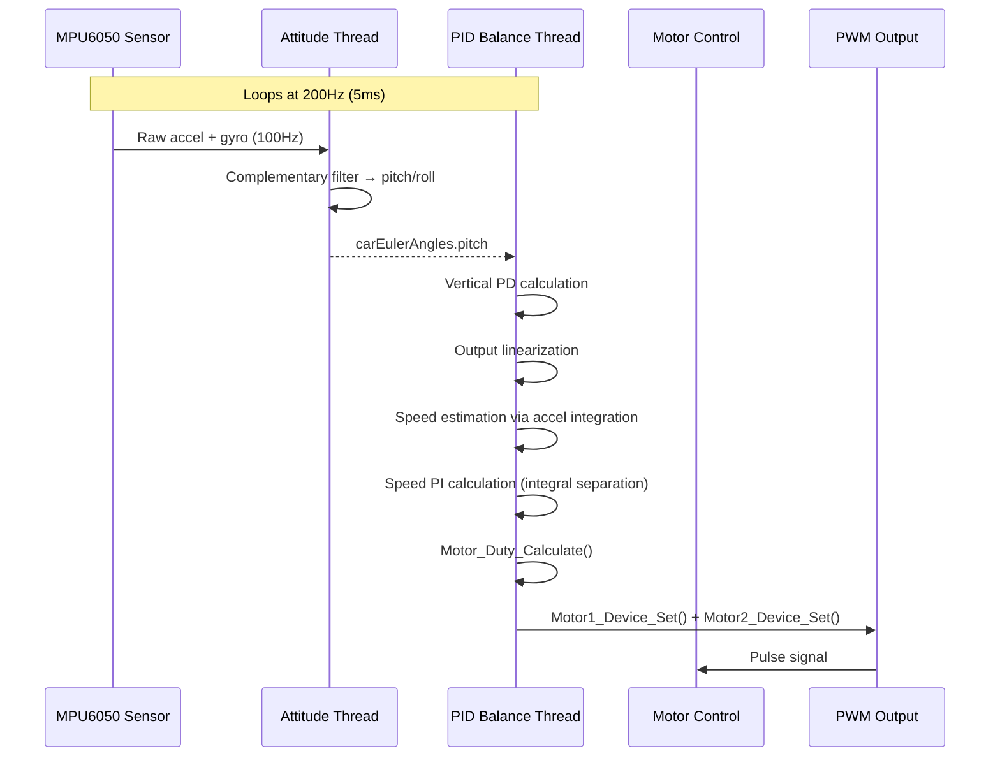

**Key Timing:**
- Attitude update rate: 100Hz (10ms)
- PID control rate: 200Hz (5ms)
- PID thread runs twice as fast as attitude thread; same angle data may be reused

### 6.2 Bluetooth Auxiliary Loop

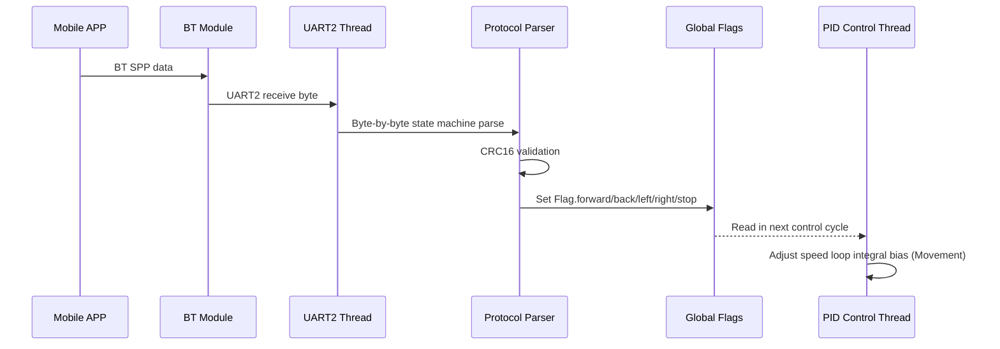

### 6.3 Calibration Status Reporting

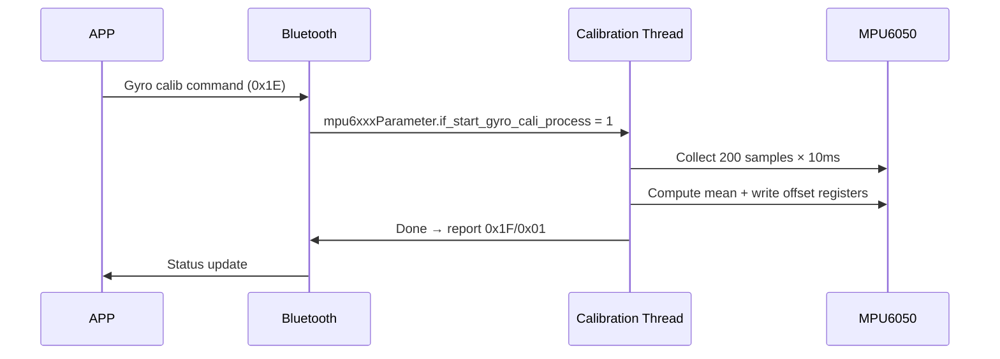

---

## 7. Build and Flash

### 7.1 Build Toolchain

| Component | Description |
|-----------|-------------|
| **Cross Compiler** | `arm-none-eabi-gcc` (GCC ARM Embedded) |
| **Build System** | SCons |
| **IDE** | RT-Thread Studio |
| **Target** | `rt-thread.elf` → `rt-thread.bin` |

### 7.2 SCons Build System

Build entry `SConstruct`:

```python
TARGET = 'rt-thread.elf'

# Use mingw tools
env = Environment(tools=['mingw'],
    AS=rtconfig.AS, CC=rtconfig.CC,
    AR=rtconfig.AR, LINK=rtconfig.LINK)
```

Toolchain config `rtconfig.py`:

```python
PREFIX = 'arm-none-eabi-'
CC = PREFIX + 'gcc'
LINK = PREFIX + 'gcc'
LFLAGS = '-T linkscripts//STM32F103RC//link.lds'
```

**Build commands:**

```bash
# Execute from project root
scons                    # Build project
scons -c                 # Clean build
scons -j4                # 4-thread parallel build
```

### 7.3 Flashing Methods

Multiple methods supported:

1. **JTAG/SWD Debugger** (e.g., ST-Link, J-Link):
   ```bash
   openocd -f interface/stlink-v2.cfg -f target/stm32f1x.cfg -c "program rt-thread.bin 0x08000000 verify reset exit"
   ```

2. **Serial ISP**:
   Use STM32Flash tool via USART1

3. **RT-Thread Studio One-click Download**:
   Configure debugger in IDE and download directly

---

## 8. Change Log

| Date | Version | Changes | Author |
|------|---------|---------|--------|
| 2025-05-23 | 1.0 | Initial release, complete design document | Clerk |

---

> **Document Note**: This document is generated from deep source code analysis of project `Diy-code_balance-car_ver1.0`. All code comments are in Chinese.
>
> **Key Global Variables:**
>
> | Variable | Type | Purpose |
> |----------|------|---------|
> | `Flag` | `FlagStruct` | Global status flags (fwd/back/left/right/stop/work status etc.) |
> | `Record` | `RecordStruct` | Log counters |
> | `carPID` | `mac_pid_t` | PID controller instance (params + process vars) |
> | `carEulerAngles` | `EulerAngles` | Current euler angles (pitch/roll/yaw) |
> | `bsp_accel` | `mpu6xxx_3axes` | Raw accelerometer data (mg) |
> | `bsp_gyro` | `mpu6xxx_3axes` | Raw gyroscope data (deg/10s) |
> | `mpu6050_dev` | `mpu6xxx_device*` | MPU6050 device handle |
> | `mpu6xxxParameter` | `mpu6xxxStruct` | MPU6050 calibration control vars |
> | `Speed_Move_Filter` | `Filter` | Speed moving average filter |
> | `Angle_Move_Filter` | `Filter` | Angle moving average filter |
> | `serial2` | `rt_device_t` | UART2 BT channel device handle |
>
> **Motor Mechanical Specs**: Step angle 1.8° / 16 microstep / 3200 pulses/rev / wheel Ø65mm
