# 蓝牙42步进电机平衡车 — 详细设计文档

> **项目名称**：Bluetooth 42 Stepper Motor Balance Car (蓝牙42步进电机平衡车)
>
> **版本**：Ver 1.0
>
> **文档创建日期**：2025-05-23
>
> **编程语言**：C
>
> **代码注释语言**：中文

---

## 目录

1. [项目概述](#一项目概述)
2. [系统架构](#二系统架构)
3. [硬件资源分配](#三硬件资源分配)
4. [RT-Thread 配置说明](#四rt-thread-配置说明)
5. [核心模块详解](#五核心模块详解)
   - [5.1 main.c — 主控制逻辑](#51-mainc--主控制逻辑)
   - [5.2 电机控制模块 (rtt_motor_ctrl)](#52-电机控制模块-rtt_motor_ctrl)
   - [5.3 PID 控制器 (rtt_motor_pid)](#53-pid-控制器-rtt_motor_pid)
   - [5.4 MPU6050 姿态解算 (macMPU)](#54-mpu6050-姿态解算-macmpu)
   - [5.5 蓝牙通信协议 (rtt_uart2_Decode)](#55-蓝牙通信协议-rtt_uart2_decode)
   - [5.6 PWM 输出 (bsp_pwm)](#56-pwm-输出-bsp_pwm)
   - [5.7 其他模块](#57-其他模块)
6. [数据流与控制流](#六数据流与控制流)
7. [编译与烧录](#七编译与烧录)
8. [变更记录](#八变更记录)

---

## 一、项目概述

### 1.1 项目目标

本项目的目标是设计并实现一台基于 STM32F103 + RT-Thread 实时操作系统的**双轮自平衡小车**。小车使用两个 42 步进电机作为执行器，MPU6050 六轴传感器作为姿态感知单元，通过蓝牙与手机 APP 进行无线通信控制。

### 1.2 功能列表

| 功能 | 描述 | 状态 |
|------|------|------|
| 直立平衡 | PD 直立环姿态闭环控制 | ✅ 已实现 |
| 速度控制 | PI 速度环闭环控制，积分分离 | ✅ 已实现 |
| 前进/后退 | 蓝牙 APP 遥控方向控制 | ✅ 已实现 |
| 左转/右转 | 蓝牙 APP 遥控转向控制 | ✅ 已实现 |
| 启动/停止 | 蓝牙 APP 启停小车站立 | ✅ 已实现 |
| 姿态解算 | MPU6050 互补滤波姿态解算，100Hz 更新率 | ✅ 已实现 |
| 传感器校准 | 陀螺仪静态校准、六面加速度计校准 | ✅ 已实现 |
| LED 指示 | 双色 LED 状态指示（运行/停止），支持闪烁与呼吸 | ✅ 已实现 |
| 蜂鸣器提示 | 指令接收成功提示音 | ✅ 已实现 |
| 参数存储 | Flash 首次启动检测与参数存储 | ✅ 已实现 |
| 蓝牙通信 | 自定义二进制通信协议，CRC16-Modbus 校验 | ✅ 已实现 |
| 调试输出 | 串口 UART1 异步打印，支持 Vofa+ 可视化调参 | ✅ 已实现 |
| 电机故障检测 | 定时检测步进电机驱动器的 nFAULT 引脚 | ✅ 已实现 |

### 1.3 硬件平台

| 组件 | 型号/描述 |
|------|-----------|
| **主控 MCU** | STM32F103RC（Cortex-M3, 72MHz, 256KB Flash, 48KB SRAM） |
| **姿态传感器** | MPU6050（6 轴陀螺仪+加速度计），I²C 接口 |
| **电机类型** | 42 步进电机（步距角 1.8°） |
| **电机驱动器** | DRV8825 兼容驱动器（支持 16 微细分） |
| **蓝牙模块** | 双模蓝牙模块（SPP + BLE），UART2 接口 |
| **电源检测** | ADC1 电池电压检测 |
| **显示** | OLED 显示屏（预留 I²C1 接口） |
| **轮胎** | 直径 65mm，周长 ≈ 204mm |

### 1.4 软件框架

| 组件 | 描述 |
|------|------|
| **RTOS** | RT-Thread v4.0.3 (Nano 扩展版) |
| **HAL 库** | STM32F1 HAL Driver |
| **驱动框架** | RT-Thread Device Driver Framework (PIN/I2C/PWM/ADC/Serial) |
| **传感器包** | mpu6xxx v1.1.1 (RT-Thread 软件包) |
| **构建系统** | SCons (RT-Thread Studio 内置) |
| **工具链** | GCC ARM Embedded (arm-none-eabi-gcc) |
| **调试工具** | Vofa+ 串口波形可视化 |

---

## 二、系统架构

### 2.1 整体软件架构

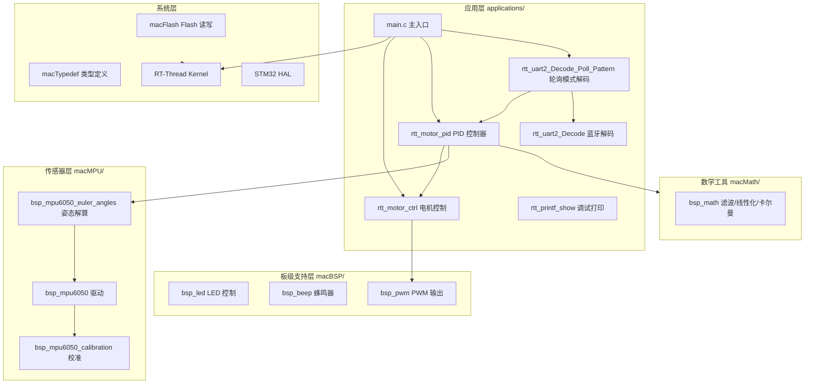

### 2.2 目录结构

```
Diy-code_balance-car_ver1.0/
├── applications/                    # 应用层代码
│   ├── main.c                       # 主入口
│   ├── macAPP/                      # 核心应用模块
│   │   ├── Inc/
│   │   │   ├── rtt_motor_ctrl.h     # 电机控制头文件
│   │   │   ├── rtt_motor_pid.h      # PID 控制器头文件
│   │   │   ├── rtt_printf_show.h    # 调试打印头文件
│   │   │   ├── rtt_uart2_Decode.h   # 蓝牙指令解析(DMA)头文件
│   │   │   └── rtt_uart2_Decode_Poll_Pattern.h # 轮询模式解码头文件
│   │   └── Scr/
│   │       ├── rtt_motor_ctrl.c     # 电机控制模块
│   │       ├── rtt_motor_pid.c      # PID 控制器模块
│   │       ├── rtt_printf_show.c    # 调试打印模块
│   │       ├── rtt_uart2_Decode.c   # 蓝牙指令解析(DMA 模式)
│   │       └── rtt_uart2_Decode_Poll_Pattern.c # 轮询解码模块
│   ├── macBSP/                      # 板级支持包
│   │   ├── Inc/
│   │   │   ├── bsp_beep.h           # 蜂鸣器头文件
│   │   │   ├── bsp_led.h            # LED 头文件
│   │   │   └── bsp_pwm.h            # PWM 头文件
│   │   └── Scr/
│   │       ├── bsp_beep.c           # 蜂鸣器驱动
│   │       ├── bsp_led.c            # LED 驱动
│   │       └── bsp_pwm.c            # PWM 驱动
│   ├── macMPU/                      # MPU6050 传感器模块
│   │   ├── Inc/
│   │   │   ├── bsp_mpu6050.h        # MPU6050 驱动头文件
│   │   │   ├── bsp_mpu6050_calibration.h # 校准头文件
│   │   │   └── bsp_mpu6050_euler_angles.h # 姿态解算头文件
│   │   └── Scr/
│   │       ├── bsp_mpu6050.c        # MPU6050 驱动实现
│   │       ├── bsp_mpu6050_calibration.c # 校准实现
│   │       └── bsp_mpu6050_euler_angles.c # 姿态解算实现
│   ├── macMath/                     # 数学工具
│   │   ├── Inc/
│   │   │   └── bsp_math.h           # 数学函数头文件
│   │   └── Scr/
│   │       └── bsp_math.c           # 滤波/线性化/卡尔曼实现
│   ├── macFLASH/                    # Flash 存取
│   │   ├── Inc/
│   │   │   └── macFlash.h           # Flash 头文件
│   │   └── Scr/
│   │       └── macFlash.c           # Flash 读写实现
│   └── macSYS/                      # 系统层
│       ├── Inc/
│       │   ├── macSYS.h             # 系统头文件(含所有 include)
│       │   └── macTypedef.h         # 类型定义、枚举、全局标志
│       └── Scr/
│           ├── macSYS.c             # 系统变量定义
│           └── macTypedef.c         # 类型变量实例
├── cubemx/                          # CubeMX 自动生成代码
├── drivers/                         # RT-Thread 驱动层
│   ├── board.c / board.h            # 板级初始化与硬件配置
│   ├── drv_pwm.c                    # PWM 驱动
│   ├── drv_usart.c                  # 串口驱动
│   ├── drv_gpio.c                   # GPIO 驱动
│   └── drv_adc.c                    # ADC 驱动
├── packages/                        # RT-Thread 软件包
│   └── mpu6xxx-v1.1.1/              # MPU6xxx 传感器驱动包
├── libraries/                       # STM32 HAL 库
├── rt-thread/                       # RT-Thread 内核源码
├── linkscripts/                     # 链接脚本
├── rtconfig.h                       # RT-Thread 配置
├── .config                          # Kconfig 配置
├── SConstruct / SConscript          # SCons 构建脚本
└── rtconfig.py                      # 工具链配置
```

### 2.3 模块依赖关系

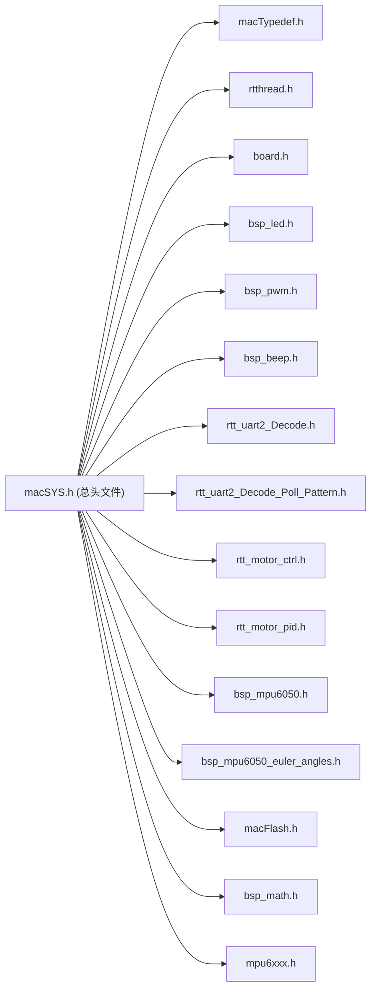

> 所有应用层模块均通过 `macSYS.h` 间接引入所有头文件。

---

## 三、硬件资源分配

### 3.1 GPIO 引脚映射表

| 功能 | 引脚 | GPIO 编号 | 描述 |
|------|------|-----------|------|
| **蓝牙 UART2 TX** | PA2 | 2 | 蓝牙模块数据发送 |
| **蓝牙 UART2 RX** | PA3 | 3 | 蓝牙模块数据接收 |
| **调试 UART1 TX** | PA9 | 9 | 调试串口发送 (Finsh) |
| **调试 UART1 RX** | PA10 | 10 | 调试串口接收 (Finsh) |
| **OLED I2C1 SCL** | PC8 | 40 | OLED 时钟线 |
| **OLED I2C1 SDA** | PC7 | 39 | OLED 数据线 |
| **MPU6050 I2C2 SCL** | PC6 | 38 | 传感器时钟线 |
| **MPU6050 I2C2 SDA** | PB15 | 31 | 传感器数据线 |
| **电机1 PWM (右轮)** | PB0 | 16 | TIM3_CH3 脉冲输出 |
| **电机2 PWM (左轮)** | PB1 | 17 | TIM3_CH4 脉冲输出 |
| **电机1 DIR (右轮)** | PA4 | 4 | 方向控制 |
| **电机1 ENABLE (右轮)** | PB3 | 19 | 使能控制 (低有效) |
| **电机1 nRESET (右轮)** | PA8 | 8 | 驱动器复位 |
| **电机1 nFAULT (右轮)** | PB11 | 27 | 驱动器故障检测 |
| **电机1 DECAY (右轮)** | PB11 | 27 | 衰减模式 (注意:与 nFAULT 共用) |
| **电机2 DIR (左轮)** | PA12 | 12 | 方向控制 |
| **电机2 ENABLE (左轮)** | PB12 | 28 | 使能控制 |
| **电机2 nRESET (左轮)** | PB13 | 29 | 驱动器复位 |
| **电机2 nFAULT (左轮)** | PB10 | 26 | 驱动器故障检测 |
| **电机2 DECAY (左轮)** | PA7 | 7 | 衰减模式 |
| **LED1** | PB5 | 21 | 状态指示灯1 |
| **LED2** | PB6 | 22 | 状态指示灯2 |
| **蜂鸣器** | PB8 | 24 | 蜂鸣器 |
| **ADC 电池检测** | — | ADC1 | 电池电压检测 |

### 3.2 外设资源分配表

| 外设 | 实例 | 功 能 | 管脚 | DMA |
|------|------|-------|------|-----|
| UART1 | USART1 | 调试串口 / Finsh 控制台 | TX:PA9, RX:PA10 | — |
| UART2 | USART2 | 蓝牙通信 | TX:PA2, RX:PA3 | 可选 DMA RX |
| I2C1 | Software I2C | OLED 显示 | SCL:PC8, SDA:PC7 | — |
| I2C2 | Software I2C | MPU6050 传感器 | SCL:PC6, SDA:PB15 | — |
| TIM3 | TIM3_CH3 | 电机1 PWM (右轮) | PB0 | — |
| TIM3 | TIM3_CH4 | 电机2 PWM (左轮) | PB1 | — |
| ADC1 | ADC1 | 电池电压检测 | — | — |

### 3.3 时钟配置

| 参数 | 值 |
|------|-----|
| 时钟源 | HSE 8MHz |
| PLL 倍频 | ×9 |
| 系统时钟 (SYSCLK) | 72 MHz |
| APB1 时钟 | 36 MHz |
| APB2 时钟 | 72 MHz |
| SysTick | 1ms (RT-Thread 系统时钟) |

### 3.4 存储器布局

| 区域 | 起始地址 | 大小 |
|------|----------|------|
| Flash | 0x08000000 | 256 KB |
| Flash 用户数据区 | 0x0801FC00 (Sector 127) | 1 KB |
| SRAM | 0x20000000 | 48 KB |

---

## 四、RT-Thread 配置说明

### 4.1 线程配置表

| 线程名称 | 优先级 | 栈大小 | 时间片 | 功能描述 |
|----------|--------|--------|--------|----------|
| `tshell` | 20 | 4096 | — | Finsh 命令行控制台 |
| `main` | 5 | 2048 | — | 主线程 (启动后挂起) |
| `timer` | 4 | 2048 | — | 软件定时器服务线程 |
| `car_euler_angles_thread_entry` | 5 | 2048 | 20 | MPU6050 姿态解算 (100Hz) |
| `uart2_decode_thread_entry` | 6 | 2048 | 500 | 蓝牙指令接收与解析 |
| `balance_car_thread_entry` | 20 | 2048 | 500 | PID 平衡控制 (200Hz) |
| `mpu6xxx_cali_thread_entry` | 6 | 2048 | 500 | MPU6050 校准线程 |
| `printf_show_thread_entry` | 29 | 2048 | 500 | 调试信息打印 |
| `ledTimer_callback` (定时器) | 4 (timer) | — | 1ms | LED 扫描定时器 |
| `beepTimer_callback` (定时器) | 4 (timer) | — | 1ms | 蜂鸣器扫描定时器 |
| `motorCheckTimer_callback` (定时器) | 4 (timer) | — | 100ms | 电机故障检测定时器 |

### 4.2 内核配置

```c
#define RT_NAME_MAX                     30      // 线程名称最大长度
#define RT_ALIGN_SIZE                   4       // 字节对齐
#define RT_THREAD_PRIORITY_32                   // 32 级优先级
#define RT_THREAD_PRIORITY_MAX          32
#define RT_TICK_PER_SECOND              1000    // 系统滴答 1kHz
#define RT_USING_OVERFLOW_CHECK                  // 栈溢出检查
#define RT_USING_HOOK                            // 系统钩子函数
#define RT_USING_IDLE_HOOK                       // 空闲线程钩子
#define IDLE_THREAD_STACK_SIZE          2048
#define RT_USING_TIMER_SOFT                      // 软件定时器
#define RT_TIMER_THREAD_PRIO            4
#define RT_TIMER_THREAD_STACK_SIZE      2048
```

### 4.3 IPC 通信组件使能

| 组件 | 状态 | 用途 |
|------|------|------|
| Semaphore | ✅ | 串口接收信号量 |
| Mutex | ✅ | 环形缓冲区互斥锁 |
| Event | ✅ | 事件标志组 |
| Mailbox | ✅ | 邮箱通信 |
| Message Queue | ✅ | 蓝牙 DMA 数据消息队列 |
| Memory Pool | ✅ | 内存池 |

### 4.4 驱动与组件使能

| 组件 | 宏定义 | 状态 |
|------|--------|------|
| Console (Finsh) | `RT_USING_FINSH` | ✅ |
| Serial Driver | `RT_USING_SERIAL` | ✅ |
| I2C Driver | `RT_USING_I2C` + `RT_USING_I2C_BITOPS` | ✅ |
| PIN Driver | `RT_USING_PIN` | ✅ |
| ADC Driver | `RT_USING_ADC` | ✅ |
| PWM Driver | `RT_USING_PWM` | ✅ |
| Device IPC | `RT_USING_DEVICE_IPC` | ✅ |
| MPU6XXX Package | `PKG_USING_MPU6XXX_V111` | ✅ |
| rt_vsnprintf_full | `PKG_USING_RT_VSNPRINTF_FULL` | ✅ |
| C++ Support | `RT_USING_CPLUSPLUS` | ✅ |
| LIBC | `RT_USING_LIBC` | ✅ |

---

## 五、核心模块详解

### 5.1 main.c — 主控制逻辑

#### 启动流程

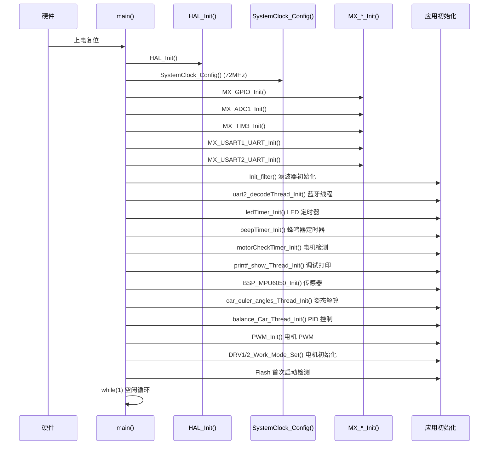

#### 启动初始化顺序说明

初始化顺序遵循**依赖优先**原则：

1. **滤波器初始化**：先初始化滑动滤波器（速度、角度），因为后续 PID 模块会使用
2. **通信线程**：提前创建蓝牙解码线程，避免丢帧
3. **外设驱动**：LED/蜂鸣器/电机检测的定时器驱动
4. **调试输出线程**：方便后续模块初始化时打印日志
5. **传感器初始化**：MPU6050 初始化（通过 RT-Thread mpu6xxx 包）
6. **姿态解算线程**：依赖传感器已初始化
7. **PID 平衡控制线程**：依赖姿态解算线程提供角度数据
8. **PWM 输出初始化**：电机驱动脉冲输出
9. **Flash 首次启动检测**：读取 `0x0801FC00` (Flash Sector 127) 是否为 `0x66`
   - 首次启动 (`!= 0x66`)：发送蓝牙 AT 指令配置（进入命令模式 → 设置 BLE 名称 → 复位），写入 `0x66` 标记
   - 非首次启动 (`== 0x66`)：跳过 AT 配置，直接进入协议模式

#### 蓝牙模块首次配置 (Poll Pattern 模式)

```c
// AT 指令序列
"AT+ENAT\r\n"              // 进入命令模式
"AT+LENABalanceCar\r\n"    // BLE 名称: BalanceCar
"AT+REST\r\n"              // 蓝牙模块复位
```

复位后自动进入数据透传模式，由 `Flag.AT_REC_Mode = 0` 和 `Flag.Protocal_Mode = 1` 切换到二进制协议模式。

---

### 5.2 电机控制模块 (rtt_motor_ctrl)

#### 步进电机参数

| 参数 | 值 | 说明 |
|------|-----|------|
| 步距角 | 1.8° | 电机每步旋转角度 |
| 微细分数 | 16 | 驱动器细分设置 |
| 每转脉冲数 | 3200 | 360° ÷ 1.8° × 16 |
| 轮胎直径 | 65mm | |
| 轮胎周长 | ≈ 204mm | |

#### 转速计算公式

```
每转步数 = 360° / 步距角(1.8°) × 细分数(16) = 3200 脉冲/转

PRM = 脉冲频率(Hz) / 每转步数 × 60

线速度(m/s) = PRM × 周长(m) / 60
```

#### 控制接口 API

**单电机控制：**

| 函数 | 功能 | 参数 |
|------|------|------|
| `DRV1_Enable_Set(status)` | 电机1 使能/失能 | `drv_en`(0)/`drv_disen`(1) |
| `DRV1_Direction_Config(direction)` | 电机1 方向设置 | `clockwise`(1)/`anticlockwise`(0) |
| `DRV1_nRESET_Config(value)` | 电机1 复位控制 | `drv_set`(1)/`drv_reset`(0) |
| `DRV1_Decay_Config(decay)` | 电机1 衰减模式 | `slow`/`quick`/`mixed_decay` |
| `DRV2_Enable_Set(status)` | 电机2 使能/失能 | 同上 |
| `DRV2_Direction_Config(direction)` | 电机2 方向设置 | 同上 |
| `DRV2_nRESET_Config(value)` | 电机2 复位控制 | 同上 |
| `DRV2_Decay_Config(decay)` | 电机2 衰减模式 | 同上 |

**协调控制：**

| 函数 | 功能 |
|------|------|
| `DRV1_Work_Mode_Set(status, direction, Period, Dutyfactor)` | 电机1 完整工作模式设置 |
| `DRV2_Work_Mode_Set(status, direction, Period, Dutyfactor)` | 电机2 完整工作模式设置 |
| `ALL_Motor_Direction_Config(dir)` | 根据倾倒方向自动设置两电机方向 |

#### 左右电机对应关系

| 电机 | 位置 | 方向定义 |
|------|------|----------|
| **DRV1** | 右轮 | forward: `anticlockwise` |
| **DRV2** | 左轮 | forward: `clockwise` |

#### 电机故障检测

通过 `motorCheckTimer` 定时器每 100ms 轮询 `DRV1_nFAULT` / `DRV2_nFAULT` 引脚：
- 引脚为低电平 (`GPIO_PIN_RESET`)：电机驱动器报错，打印硬故障日志
- 引脚为高电平：正常

#### 小车拿起检测（未完成）

`If_Car_Was_Picked_Up()` 函数已声明但实现为空，计划通过 Z 轴加速度和俯仰角变化判断。

---

### 5.3 PID 控制器 (rtt_motor_pid)

#### PID 算法架构

平衡车控制系统采用**双环串级 PID** 结构：

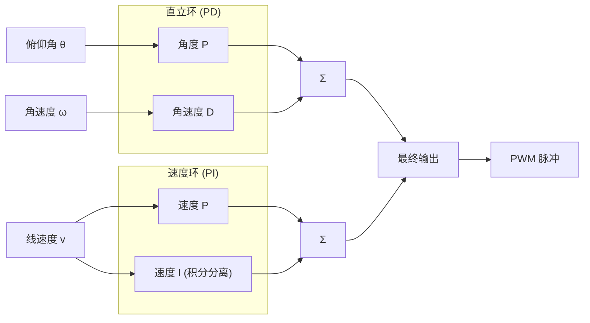

#### 直立环 (PD 控制器)

**数学模型**：`Output = Kp * (θ - θ_target) + Kd * (ω - 0)`

| 参数 | 值 | 说明 |
|------|-----|------|
| Kp | 15.0 | 比例系数 |
| Ki | 0 | 不使用积分项 |
| Kd | 0.1 | 微分系数 |
| dt | 0.005s (5ms) | 控制周期 |
| 输出限幅 | ±1300 | 脉冲频率 (Hz) |
| 机械中值 | 0.36° | 平衡机械角度 |

**控制逻辑**：
1. 计算角度误差 = 当前角度 − 机械中值(0.36°)
2. 对角度误差做滑动平均滤波 (MVF_LENGTH=4)
3. 角速度单位转换：MPU6050 输出单位 `deg/10s` → `deg/s` (×0.1)
4. **PD 计算**：`Out = Kp × 角度误差 + Kd × 角速度`
5. 输出限幅 `±1300`

> 注：直立环使用**PD 控制**（无积分项），微分项直接使用陀螺仪角速度，实现快速响应。

#### 速度环 (PI 控制器)

**数学模型**：`Output = Kp * (v_target − v_present) + Ki * Σ(bias * dt)`

| 参数 | 值 | 说明 |
|------|-----|------|
| Kp | 10.0 | 比例系数 |
| Ki | 0.1 | 积分系数 |
| Kd | 0 | 不使用微分项 |
| dt | 0.005s | 控制周期 |
| 积分分离阈值 | ±3000 | 偏差过大大时暂停积分 |
| 积分限幅 | ±3000 | 积分值限幅 |
| 输出限幅 | ±6000 | 脉冲频率 (Hz) |
| 速度目标 (前进) | 2000 | 前进时的积分偏置 |
| 速度目标 (后退) | -2000 | 后退时的积分偏置 |

**控制逻辑**：
1. 估算当前线速度：`v = ∫(accel_x − g·sinθ)dt`（通过加速度计积分得到）
2. 对速度做滑动平均滤波 + 一阶低通滤波 (α=0.7)
3. **积分分离**：当速度偏差超过 ±3000 时，不进行积分积累
4. 前进/后退指令：在积分项上叠加 ±2000 的偏置（`Movement`）
5. 积分限幅 `±3000`
6. **PI 计算**：`Out = Kp × 速度偏差 + Ki × 积分值`
7. 输出限幅 `±6000`

> 注：速度环通过**改变积分量**实现前进/后退控制，而非直接改变目标速度。前进时积分偏置 +2000，后退时 −2000。

#### 输出线性化

直立环输出的 PID 值经过 `linearized_output()` 函数处理：

```
若 PID 输出 < 0 → 向后方向，Left_Direction=Right_Direction=0
若 PID 输出 ≥ 0 → 向前方向，Left_Direction=Right_Direction=1

Output = PID 输出限幅(1300) − |PID 输出|
若 Output < 900 → Output = 900 (最低频率)
```

这意味着：
- 倾斜越严重 → |PID输出| 越大 → Output 越小 → PWM 周期越小 → 频率越高 → 电机越快
- 平衡时 PID 输出 ≈ 0 → Output ≈ 1300 → PWM 周期较大 → 频率较低

#### PID 数据结构

```c
struct _PID_T {
    PID_Parameter speedParam;       // 速度环参数 (kp, ki, kd, 限幅, 阈值)
    PID_Parameter verticalParam;    // 直立环参数 (kp, ki, kd, 限幅, 阈值)
    PID_Process   speedProcess;     // 速度环过程变量 (偏差, 积分, 输出)
    PID_Process   verticalProcess;  // 直立环过程变量 (偏差, 积分, 输出)
};
```

#### 平衡控制线程 (balance_car_thread_entry)

- **优先级**：20 (较低)
- **栈大小**：2048 字节
- **控制周期**：5ms (200Hz)
- **执行流程**：

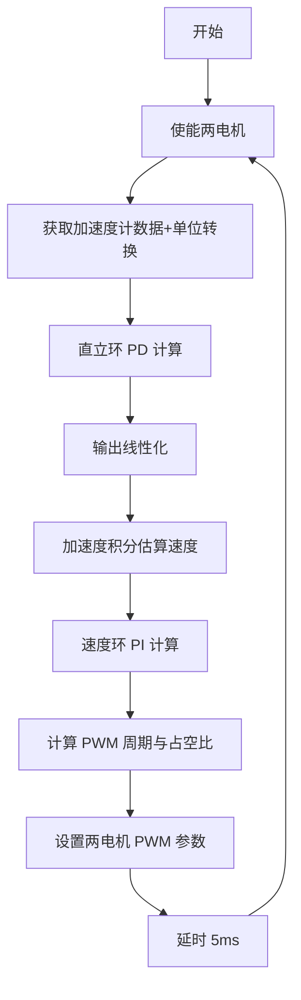

---

### 5.4 MPU6050 姿态解算 (macMPU)

#### 传感器初始化

通过 RT-Thread `mpu6xxx` 软件包驱动：

```c
// I2C2 软件模拟 (SCL:PC6, SDA:PB15)
mpu6050_dev = mpu6xxx_init("i2c2", RT_NULL);
```

#### 数据读取

```c
mpu6xxx_get_accel(dev, &bsp_accel);  // 原始值，单位 mg
mpu6xxx_get_gyro(dev, &bsp_gyro);    // 原始值，单位 deg/10s
```

#### 姿态解算算法 — 互补滤波

**核心原理**：`angle = α * 陀螺仪积分角 + (1-α) * 加速度计计算角`

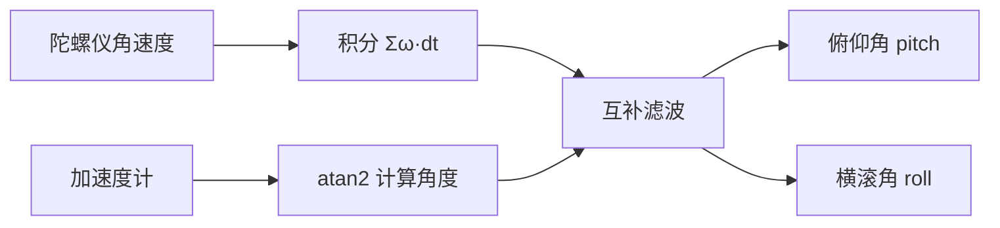

**关键参数：**

| 参数 | 值 | 说明 |
|------|-----|------|
| 采样频率 | 100 Hz | SAMPLE_RATE |
| 采样周期 | 10 ms | DT = 1/100 |
| 互补滤波系数 α | 0.99 | 信任陀螺仪 99%，加速度计 1% |
| 陀螺仪单位转换 | ×0.1 | deg/10s → deg/s |

**姿态解算过程**：

1. **坐标转换**：`transform_coordinates()` 支持 X/Y 轴互换模式（当前使用 `nothing` 模式）
2. **加速度计计算角度**：
   ```c
   pitch_acc = atan2(-ax, sqrt(ay² + az²)) * RAD_TO_DEG;
   roll_acc  = atan2(ay, az) * RAD_TO_DEG;
   ```
3. **陀螺仪积分**：
   ```c
   pitch += gyro_y * 0.1 * DT;  // 绕 Y 轴 → Pitch
   roll  += gyro_x * 0.1 * DT;  // 绕 X 轴 → Roll
   ```
4. **互补滤波融合**：
   ```c
   pitch = 0.99 * pitch + 0.01 * pitch_acc;
   roll  = 0.99 * roll  + 0.01 * roll_acc;
   ```

> Yaw 角需要磁力计支持，当前未实现。

#### 欧拉角数据结构

```c
typedef struct {
    float pitch;  // 俯仰角 (度)
    float roll;   // 横滚角 (度)
    float yaw;    // 偏航角 (度) — 未使用
} EulerAngles;
```

全局变量 `carEulerAngles` 存储最新的姿态数据。

#### 校准模块

##### 陀螺仪静态校准

通过 APP 指令触发 (`FRAME_SET_CAR_GYRO_CALIBRATION_CMD`)，在 `mpu6xxx_cali_thread_entry` 线程中执行：

1. 采集 200 组陀螺仪原始数据（间隔 10ms，共 2 秒）
2. 计算三轴平均值作为零偏 offset
3. 调用 `mpu6xxx_set_gyro_offset()` 写入 MPU6050 偏移寄存器
4. 完成通知 APP：`Order_SEND_CAR_IS_FINISHED_GYRO_CALI_CMD`

##### 六面加速度计校准

通过 APP 指令触发，依次将 MPU6050 六个面对准下方，每面采集 50 组数据：
- X+ / X- (0x18 / 0x19)
- Y+ / Y- (0x1A / 0x1B)
- Z+ / Z- (0x1C / 0x1D)
- 完成后计算每轴 min/max，求 offset 并写入寄存器

---

### 5.5 蓝牙通信协议 (rtt_uart2_Decode)

#### 通信模式

系统支持**两种通信模式**，由 `USE_UART2_DMA_MODE` 宏控制：

| 模式 | 宏 | 方案 |
|------|-----|------|
| 轮询(Poll)模式 | `USE_UART2_DMA_MODE = 0` | 中断接收 → 信号量 → 环形缓冲区 → 逐字节状态机解析 |
| DMA 模式 | `USE_UART2_DMA_MODE = 1` | DMA 接收 → 消息队列 → 块数据整体解析 + 二次粘连解析 |

> 当前项目使用**轮询模式**（Poll Pattern），通过 `rtt_uart2_Decode_Poll_Pattern.c` 实现。

#### 数据帧格式

```
┌──────┬──────┬──────┬─────────────┬───────┬─────────────────────┬──────────────┐
│ 0x55 │ 0xAA │ Len  │  DeviceID   │ Cmd   │   Data (Len−4 字节)  │   CRC16      │
│ 帧头1│ 帧头2│ 长度 │ H(0x00)     │ 类型  │  可变长度数据域       │  2 字节校验   │
│      │      │ 1字节│ L(0x01)     │       │                     │              │
└──────┴──────┴──────┴─────────────┴───────┴─────────────────────┴──────────────┘
```

**帧结构说明**：

| 字段 | 偏移 | 大小 | 值/说明 |
|------|------|------|---------|
| Frame Head 1 | 0 | 1 | `0x55` |
| Frame Head 2 | 1 | 1 | `0xAA` |
| Length | 2 | 1 | 数据域长度（不含帧头的剩余字节数，含 CRC 前所有字段） |
| Device ID H | 3 | 1 | `0x00` (主板 ID 高位) |
| Device ID L | 4 | 1 | `0x01` (主板 ID 低位) |
| Cmd Type | 5 | 1 | 指令类型 (0x31/0x32/0x33/0x66) |
| Cmd Status | 6 | 1 | 指令状态 (0x00/0x01/0x02) |
| Data | 7+ | N | 具体指令数据 |
| CRC16 L | -2 | 1 | CRC-16/Modbus 低字节 |
| CRC16 H | -1 | 1 | CRC-16/Modbus 高字节 |

**CRC 校验**：采用 CRC-16/Modbus 标准多项式 `X¹⁶+X¹⁵+X²+1` (0xA001)

#### 帧类型宏定义

| 宏 | 值 | 含义 |
|----|-----|------|
| `FRAME_TYPE_SET` | `0x31` | 参数设置指令（APP → 主板） |
| `FRAME_TYPE_ACT` | `0x32` | 主动上报（主板 → APP） |
| `FRAME_TYPE_GET` | `0x33` | 参数获取指令 |
| `FRAME_TYPE_POST` | `0x66` | 主动推送状态 |

#### 指令集完整列表

##### APP → 主板（设置指令 0x31）

| 指令码 | 名称 | 数据 | 说明 |
|--------|------|------|------|
| `0x00` | 广播指令 | — | 测试通信 |
| `0x10` | 前进 | — | 控制小车前进 |
| `0x11` | 后退 | — | 控制小车后退 |
| `0x12` | 左转 | — | 控制小车左转 |
| `0x13` | 右转 | — | 控制小车右转 |
| `0x14` | 启动直立 | 1字节: 1=启动 | 使能平衡控制 |
| `0x15` | 停止 | 1字节: 0=停止 | 关闭平衡控制 |
| `0x16` | 设置速度 | — | 设置目标速度（预留） |
| `0x17` | 六面校准总指令 | — | 开启整体校准流程 |
| `0x18` | X+ 面校准 | — | X 轴正方向朝下 |
| `0x19` | X- 面校准 | — | X 轴负方向朝下 |
| `0x1A` | Y+ 面校准 | — | Y 轴正方向朝下 |
| `0x1B` | Y- 面校准 | — | Y 轴负方向朝下 |
| `0x1C` | Z+ 面校准 | — | Z 轴正方向朝下 |
| `0x1D` | Z- 面校准 | — | Z 轴负方向朝下 |
| `0x1E` | 陀螺仪静态校准 | — | 静止状态校准陀螺仪零偏 |
| `0x1F` | 校准状态报告 | 1字节: 步骤 | 主动上报校准进度 |
| `0x20` | 运行模式设置 | — | 设置行进模式（预留） |
| `0x21` | 机械中值校准 | — | 设置平衡机械中值 |

##### 主板 → APP（主动上报 0x32）

| 指令码 | 名称 | 数据 | 说明 |
|--------|------|------|------|
| `0xA2` | 准备就绪 | — | 小车上电完毕，通知 APP |
| `0x1F` | 校准状态 | 1字节: 步骤码 | 上报当前校准进度 |

#### 解析状态机（轮询模式）

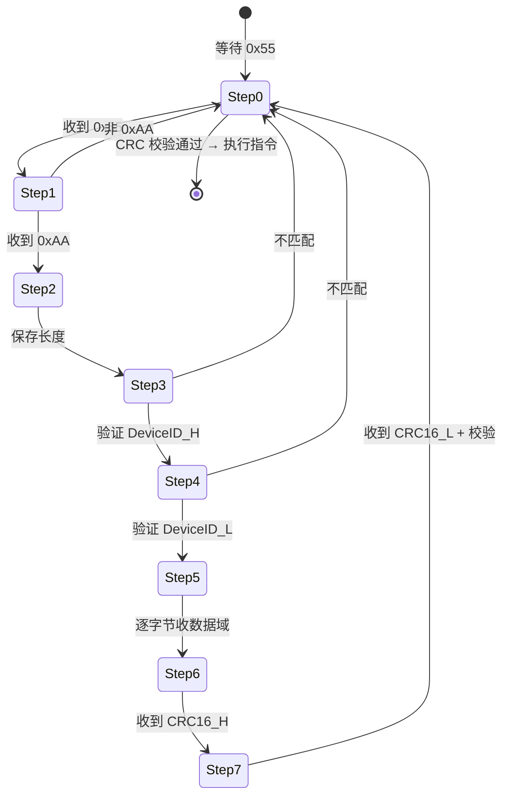

#### UART 接收流程（轮询模式）

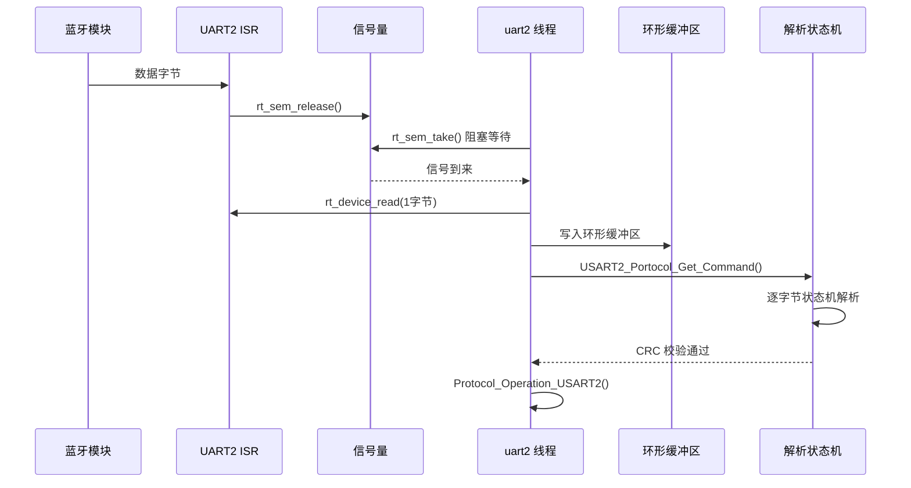

---

### 5.6 PWM 输出 (bsp_pwm)

#### PWM 配置

| 参数 | 值 | 说明 |
|------|-----|------|
| **定时器** | TIM3 | 16 位高级定时器 |
| **通道** | CH3 (电机1/右轮), CH4 (电机2/左轮) |
| **PWM 模式** | PWM1 | 向上计数，小于 CCR 时输出高 |
| **默认周期** | 1000ms (1Hz) | 初始化后的默认值 |
| **默认占空比** | 50% | 初始化后默认 50% |

#### 关键函数

| 函数 | 功能 | 参数 |
|------|------|------|
| `PWM_Init()` | 初始化 PWM 设备 | 查找 `pwm3` 设备，设置初始参数 |
| `Motor1_Device_Set(Period, Duty)` | 电机1 PWM 输出 | Period: 周期(μs), Duty: 占空比(μs) |
| `Motor2_Device_Set(Period, Duty)` | 电机2 PWM 输出 | 同上 |
| `Motor_Duty_Calculate(Period)` | 计算占空比 | 占空比 = Period / 2 (50%) |

**注意**：`Motor1_Device_Set()` 实际控制 `pwm_dev2`（TIM3_CH4），`Motor2_Device_Set()` 控制 `pwm_dev1`（TIM3_CH3），函数名与实际驱动的对应关系已通过内部映射处理。

#### 驱动信号生成

步进电机通过脉冲频率控制转速：
- 平衡控制线程每 5ms 更新一次 PWM 周期
- PID 输出值直接作为脉冲周期（μs），频率 = 1/周期
- 占空比固定 50%（`Motor_Duty_Calculate`）
- 周期范围：900~1300 μs（对应频率 769~1111 Hz）

---

### 5.7 其他模块

#### 5.7.1 LED 模块 (bsp_led)

**LED 定义：**
| LED | GPIO | 引脚编号 |
|-----|------|----------|
| LED1 | PB5 | 21 |
| LED2 | PB6 | 22 |

**功能特性：**
- **常亮/常灭**：`LED_On()`, `LED_Off()`
- **翻转**：`LED_Toggle()`
- **闪烁**：`LED_Blink(name, cry, mute, repeat)` 支持周期、次数、重复控制
- **呼吸渐变**：`LED_Grad()` 支持 PWM 模拟呼吸灯效果
- **时间基准**：1ms 软件定时器 (`ledTimer_callback`)

**状态指示：**
- LED1 常亮：表示在小车处于直立站立状态
- LED2 常亮：表示在小车处于停止状态
- 收到有效蓝牙指令：LED1 闪烁 1 次

#### 5.7.2 蜂鸣器模块 (bsp_beep)

**引脚**：PB8

**功能特性：**
- **长鸣/关闭**：`BEEP_On()`, `BEEP_Off()`
- **间隔鸣叫**：`BEEP_Blink(cry, mute, repeat)` 支持三期控制（小周期/中周期/大周期）
- **时间基准**：1ms 软件定时器，默认 200ms 周期、100ms 占空比
- **指令反馈**：收到有效蓝牙指令时鸣叫 1 次

#### 5.7.3 Flash 参数存储 (macFlash)

使用 STM32 片内 Flash 最后一页 (Sector 127, `0x0801FC00`) 存储配置：

| 功能 | 地址 | 数据 |
|------|------|------|
| 首次启动标记 | `0x0801FC00` | `0x66` 表示已完成初始化 |

**API 函数**：
- `macNorFlash_Read_Byte/Word()` — 读 Flash
- `macNorFlash_Write_Byte/Word()` — 写 Flash
- `macNorFlash_Erase_Page()` — 擦除页

#### 5.7.4 数学工具 (bsp_math)

| 函数 | 功能 | 说明 |
|------|------|------|
| `moving_average_filtre()` | 滑动平均滤波 | 窗口大小 `MVF_LENGTH=4` |
| `FOLowPassFilter(In, LastOut, a)` | 一阶低通滤波 | `Out = a·In + (1-a)·LastOut` |
| `linearized_output(mode, Values)` | 输出线性化 | PID 输出 → PWM 周期映射 |
| `kalman_filter_for_pitch()` | 卡尔曼滤波 (pitch) | 2 状态卡尔曼（角度+零偏），已实现但未使用 |
| `myabs()` | 绝对值 | 整型版 |

**滤波器实例**：
- `Speed_Move_Filter`：速度滑动平均滤波器
- `Angle_Move_Filter`：角度误差滑动平均滤波器

#### 5.7.5 调试打印模块 (rtt_printf_show)

- **优先级**：29 (最低)
- **功能**：通过 UART1 输出 PID 各环节的实时数值
- **Vofa+ 兼容**：通过 `<any>` 标签格式输出 CSV 数据，支持 Vofa+ 上位机实时可视化
- **可选择性输出**：通过 `mylog` 结构体开关控制直立环、速度环、Vofa+ 输出

---

## 六、数据流与控制流

### 6.1 主控制环路

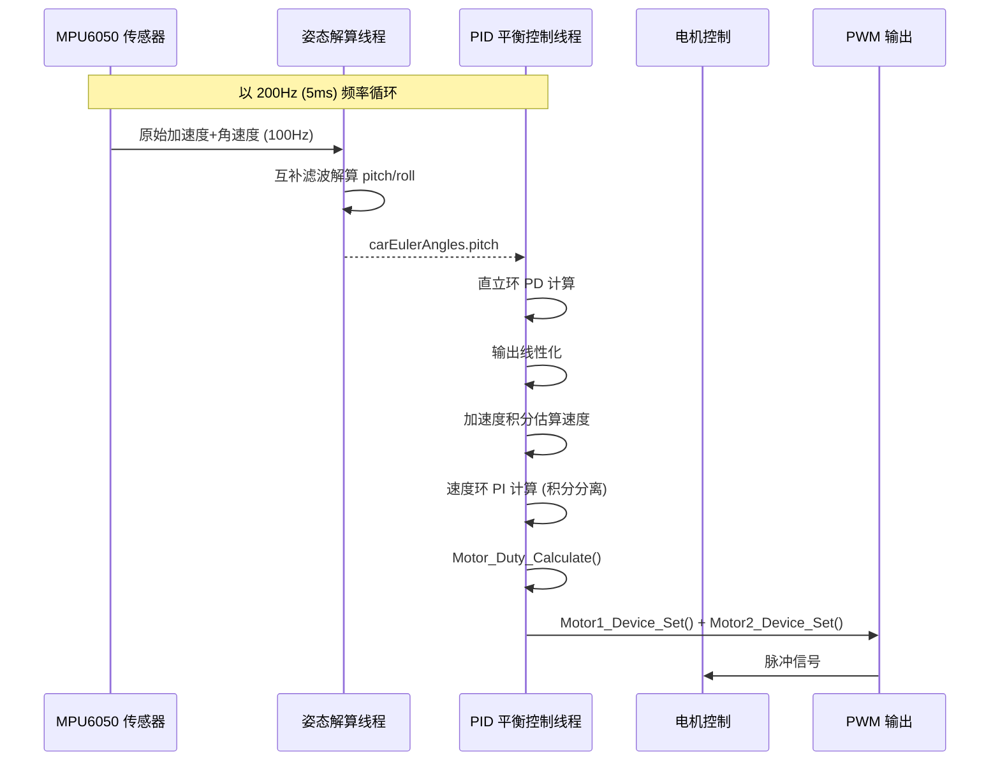

**关键时序**：
- 姿态解算更新率：100Hz (10ms)
- PID 控制更新率：200Hz (5ms)
- PID 线程比姿态线程快一倍，同一次角度数据可能被使用两次

### 6.2 蓝牙辅助环路

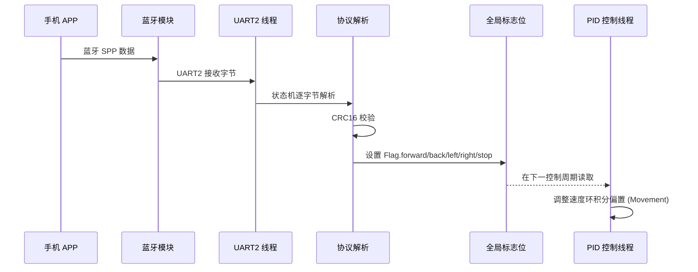

### 6.3 指令上报流程（校准状态）

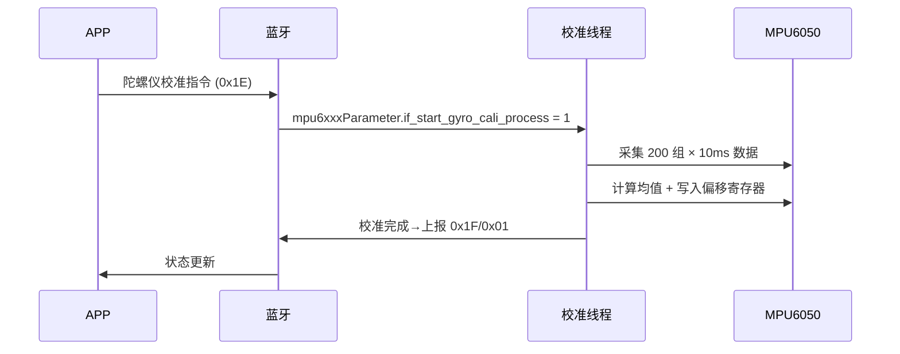

---

## 七、编译与烧录

### 7.1 编译工具链

| 组件 | 描述 |
|------|------|
| **交叉编译器** | `arm-none-eabi-gcc` (GCC ARM Embedded) |
| **构建系统** | SCons |
| **开发环境** | RT-Thread Studio |
| **目标文件** | `rt-thread.elf` → `rt-thread.bin` |

### 7.2 SCons 构建系统说明

构建入口文件 `SConstruct`：

```python
TARGET = 'rt-thread.elf'

# 使用 mingw 工具
env = Environment(tools=['mingw'],
    AS=rtconfig.AS, CC=rtconfig.CC,
    AR=rtconfig.AR, LINK=rtconfig.LINK)
```

工具链配置 `rtconfig.py`：

```python
PREFIX = 'arm-none-eabi-'
CC = PREFIX + 'gcc'
LINK = PREFIX + 'gcc'
LFLAGS = '-T linkscripts//STM32F103RC//link.lds'
```

**构建命令**：

```bash
# 在项目根目录执行
scons                    # 编译项目
scons -c                 # 清理编译
scons -j4                # 4 线程并行编译
```

### 7.3 烧录方法

支持多种烧录方式：

1. **JTAG/SWD 调试器**（如 ST-Link、J-Link）：
   ```bash
   openocd -f interface/stlink-v2.cfg -f target/stm32f1x.cfg -c "program rt-thread.bin 0x08000000 verify reset exit"
   ```

2. **串口 ISP 烧录**：
   使用 STM32Flash 工具通过 USART1 烧录

3. **RT-Thread Studio 一键烧录**：
   在 IDE 内配置调试器后直接下载

---

## 八、变更记录

| 日期 | 版本 | 变更内容 | 作者 |
|------|------|----------|------|
| 2025-05-23 | 1.0 | 初始版本，完整设计文档 | Clerk |

---

> **文档说明**：本文档基于项目 `Diy-code_balance-car_ver1.0` 源码深度分析生成，所有代码注释为中文。
>
> **关键全局变量清单**：
>
> | 变量 | 类型 | 用途 |
> |------|------|------|
> | `Flag` | `FlagStruct` | 全局状态标志（前进/后退/左转/右转/停止/工作状态等） |
> | `Record` | `RecordStruct` | 日志计数器 |
> | `carPID` | `mac_pid_t` | PID 控制器实例（参数+过程变量） |
> | `carEulerAngles` | `EulerAngles` | 当前欧拉角（pitch/roll/yaw） |
> | `bsp_accel` | `mpu6xxx_3axes` | 加速度计原始数据（单位 mg） |
> | `bsp_gyro` | `mpu6xxx_3axes` | 陀螺仪原始数据（单位 deg/10s） |
> | `mpu6050_dev` | `mpu6xxx_device*` | MPU6050 设备句柄 |
> | `mpu6xxxParameter` | `mpu6xxxStruct` | MPU6050 校准控制变量 |
> | `Speed_Move_Filter` | `Filter` | 速度滑动滤波器 |
> | `Angle_Move_Filter` | `Filter` | 角度滑动滤波器 |
> | `serial2` | `rt_device_t` | UART2 蓝牙通道设备句柄 |
>
> **电机机械参数**：步距角 1.8° / 16 细分 / 3200 脉冲每转 / 轮胎 65mm 直径
